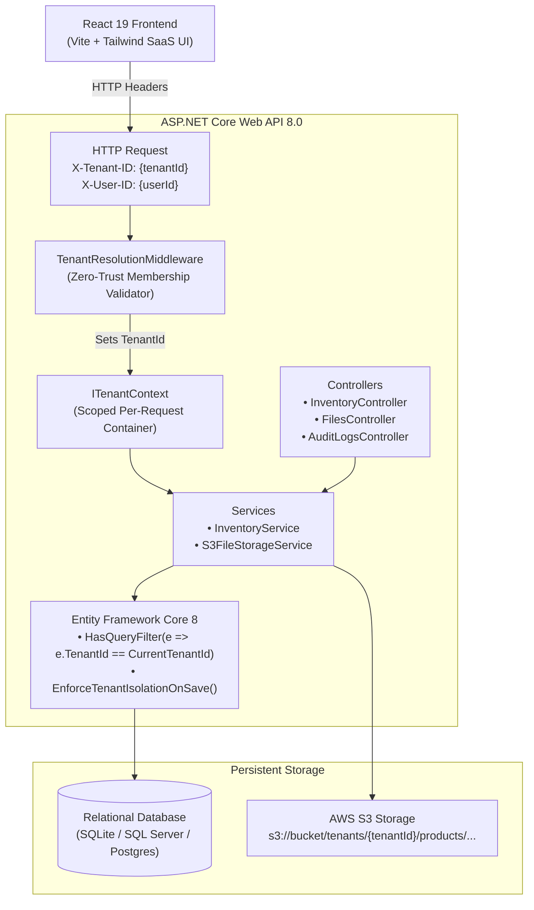
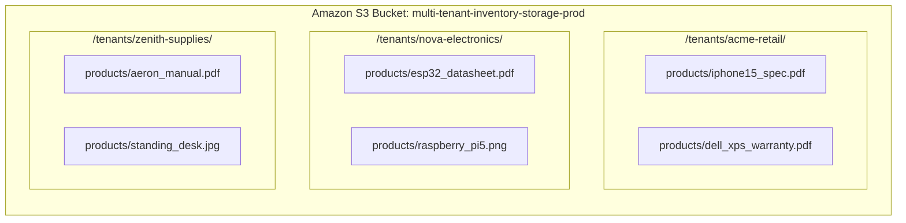
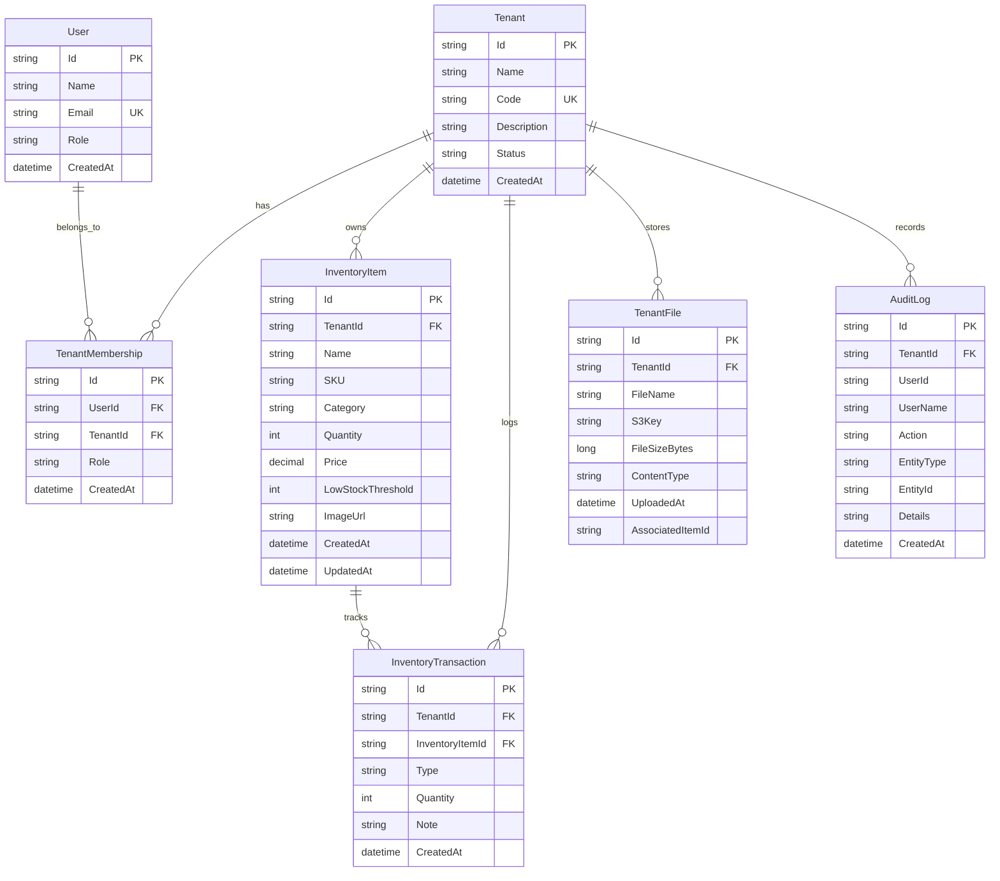

# ARCHITECTURE & SECURITY SPECIFICATION

## Multi-Tenant Inventory Management Platform

This document details the architectural blueprint, isolation layers, data models, and request pipelines of the Nexus Multi-Tenant Inventory Platform.

---

## 1. High-Level System Architecture

---

## 2. Request Lifecycle & Tenant Resolution Sequence

```mermaid
sequenceDiagram
    autonumber
    actor User as Client / Browser
    participant Middleware as TenantResolutionMiddleware
    participant Resolver as ITenantResolver
    participant Context as ITenantContext
    participant Controller as InventoryController
    participant Service as InventoryService
    participant EF as EF Core (AppDbContext)
    participant DB as SQL Database

    User->>Middleware: GET /api/inventory (Header: X-Tenant-ID: acme-retail, User: usr_admin_1)
    
    rect rgb(30, 41, 59)
        note over Middleware, Resolver: Zero-Trust Tenant Resolution
        Middleware->>Resolver: GetTenantByIdAsync("acme-retail")
        Resolver-->>Middleware: Tenant Exists (Acme Retail)
        
        Middleware->>Resolver: IsUserAuthorizedForTenantAsync("usr_admin_1", "acme-retail")
        Resolver-->>Middleware: Authorized = TRUE
        
        Middleware->>Context: SetTenant("acme-retail", "usr_admin_1")
    end
    
    Middleware->>Controller: Invoke Action
    Controller->>Service: GetItemsAsync()
    Service->>EF: _dbContext.InventoryItems.ToListAsync()
    
    rect rgb(15, 23, 42)
        note over EF, DB: Global Query Filter Applied Automatically
        EF->>DB: SELECT * FROM InventoryItems WHERE TenantId = 'acme-retail'
        DB-->>EF: [iPhone 15, Dell XPS 15, Samsung G9]
    end
    
    EF-->>Service: Tenant Items
    Service-->>Controller: DTOs
    Controller-->>User: 200 OK (Isolated Tenant Data)
```

---

## 3. S3 File Storage Partitioning

### Key Security Invariants:
1. S3 Key Path Derivation: Keys are generated exclusively server-side using `$"tenants/{_tenantContext.CurrentTenantId}/products/{guid}_{sanitizedFilename}"`.
2. Path Traversal Defense: Client-supplied directory paths are ignored and sanitized.
3. Access Authorization: Pre-signed download URLs and streaming endpoints check `TenantFile.TenantId == CurrentTenantId` before retrieval.

---

## 4. Entity-Relationship Data Model

