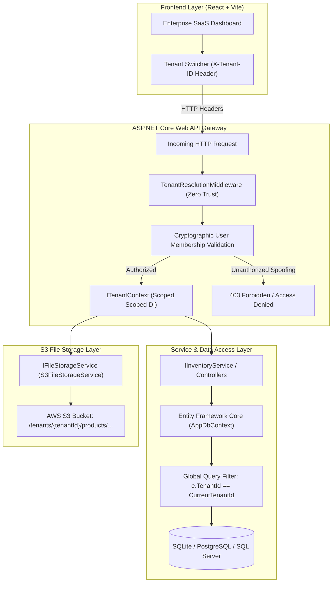

# INVENTRA MULTI-TENANT INVENTORY PLATFORM

[](https://dotnet.microsoft.com/)
[](https://learn.microsoft.com/en-us/ef/core/)
[](https://react.dev/)
[](https://aws.amazon.com/s3/)
[](#security-guarantees)

---

## 📌 Executive Summary

**Inventra Multi-Tenant Inventory Platform** is a production-grade SaaS architecture designed to host multiple independent organizations (*Acme Retail*, *Nova Electronics*, *Zenith Supplies*) on a shared infrastructure while enforcing **hardware-grade mathematical isolation** of data and file storage across all application layers.

### Core Tenet
> **"Never trust client claims alone."**
> A request header such as `X-Tenant-ID` only states *requested context*. Tenant isolation is strictly enforced through server-side cryptographic user-membership validation, scoped dependency injection (`ITenantContext`), and **EF Core Global Query Filters** that automatically inject tenant boundary predicates into every database query.

---

## 🏗 Multi-Tenant Architecture & Defense-in-Depth



---

## 🛡 Demonstrable Isolation Across 6 Layers

| Layer | Implementation Mechanism | Security Guarantee |
| :--- | :--- | :--- |
| **1. Middleware Layer** | `TenantResolutionMiddleware` | Intercepts `X-Tenant-ID` and cross-validates against database `TenantMemberships`. Rejects unauthorized spoofing with `403 Forbidden`. |
| **2. Scoped Context** | `ITenantContext` / `TenantContext` | Thread-safe per-request DI container lifetime holding verified `CurrentTenantId`. |
| **3. EF Core Data Access** | `.HasQueryFilter(e => e.TenantId == _tenantContext.CurrentTenantId)` | Automatically appends `WHERE TenantId = @currentTenant` to all `SELECT`, `UPDATE`, `DELETE` queries. |
| **4. Database Storage** | `ITenantEntity` & Composite Unique Indexes `(TenantId, SKU)` | Hard multitenant relational schemas preventing cross-tenant collisions. |
| **5. File Storage (AWS S3)** | `IFileStorageService` + `tenants/{tenantId}/products/{fileName}` | S3 key paths derived strictly from server tenant context. No client-supplied path traversal possible. Cascade cleanup on product delete. |
| **6. Frontend Dashboard** | Complete cache invalidation & re-fetch on tenant switch | UI reflects only authorized tenant data; offers live interactive security attack bench for hackathon judges. |

---

## 👥 Seeded Demo Tenants & User Personas

The platform seeds 3 distinct organizations and 4 user personas with varying permissions:

### Demo Tenants
1. **Acme Retail** (`acme-retail`): High-volume consumer electronics (iPhone 15 Pro, Dell XPS 15, Samsung Odyssey G9, Sony XM5).
2. **Nova Electronics** (`nova-electronics`): Embedded IoT systems & microcontrollers (ESP32-WROOM-32D, Arduino Uno R4 WiFi, Raspberry Pi 5, STM32).
3. **Zenith Supplies** (`zenith-supplies`): Premium enterprise office furnishings & equipment (Herman Miller Aeron, HP LaserJet Pro, Keychron Q1 Pro).

### Demo User Personas
* **Admin User (`usr_admin_1`)**: Authorized for **Acme Retail** and **Nova Electronics**. (Blocked from Zenith Supplies).
* **Nova Electronics Manager (`usr_manager_nova`)**: Authorized ONLY for **Nova Electronics**.
* **Zenith Supplies Specialist (`usr_zenith_user`)**: Authorized ONLY for **Zenith Supplies**.
* **Acme Compliance Auditor (`usr_auditor_acme`)**: Read-only access for **Acme Retail**.

---

## 🚀 Quick Start Guide

### Prerequisites
- [.NET 8.0 or 9.0 SDK](https://dotnet.microsoft.com/)
- [Node.js v18+ & npm](https://nodejs.org/)

### 1. Run the Backend API
```powershell
cd backend/MultiTenantInventory.Api
dotnet run
```
* API Server will start at: `http://localhost:5000`
* Interactive Swagger API Docs: `http://localhost:5000/swagger`

### 2. Run the Frontend Dashboard
```powershell
cd frontend
npm install
npm run dev
```
* Open in browser: `http://localhost:5173`

---

## 🧪 Running Automated Security Verification Tests

Execute the comprehensive xUnit test suite covering all tenant isolation and cascade cleanup invariants:

```powershell
dotnet test backend/MultiTenantInventory.Tests/MultiTenantInventory.Tests.csproj
```

---

## 🎯 Step-by-Step Hackathon Judge Demonstration Flow

Follow these steps to demonstrate the security and feature capabilities:

1. **Step 1 - User Persona Inspection:** In the top-right navbar, inspect the active user persona **Admin User** (Authorized for *Acme Retail* and *Nova Electronics*).
2. **Step 2 - Acme Retail Inventory:** View the active inventory for *Acme Retail* (iPhone 15, Dell XPS, etc.) and note the total inventory valuation.
3. **Step 3 - Zero-Trust Tenant Switching:** Switch the tenant dropdown to **Nova Electronics**. Notice that the catalog instantly loads microcontroller inventory (ESP32, Raspberry Pi) via network request with `X-Tenant-ID: nova-electronics`.
4. **Step 4 - Live Security Attack Bench:** Open the **"Isolation Bench"** from the left sidebar.
5. **Step 5 - Execute IDOR Attack Simulation:** Click **"Simulate"** on *1. Cross-Tenant IDOR*. Observe how accessing another tenant's product ID returns `404 Not Found / 403 Forbidden` due to EF Core Global Query Filters.
6. **Step 6 - Execute Header Spoofing Attack:** Click **"Simulate"** on *2. Header Tampering*. The system attempts to inject `X-Tenant-ID: zenith-supplies` for the Admin User. Observe the `403 Forbidden` rejection and real-time security violation log.
7. **Step 7 - S3 Tenant File Storage & Cascade Cleanup:** Navigate to **"Storage & Files"**. Upload a file and inspect the derived S3 key format: `/tenants/{currentTenantId}/products/...`. Delete the associated product and observe both the product and S3 file are safely purged.
8. **Step 8 - Audit Trail Verification:** Open **"Audit Trail"** and observe tenant-scoped immutable audit trails and security violation records.
