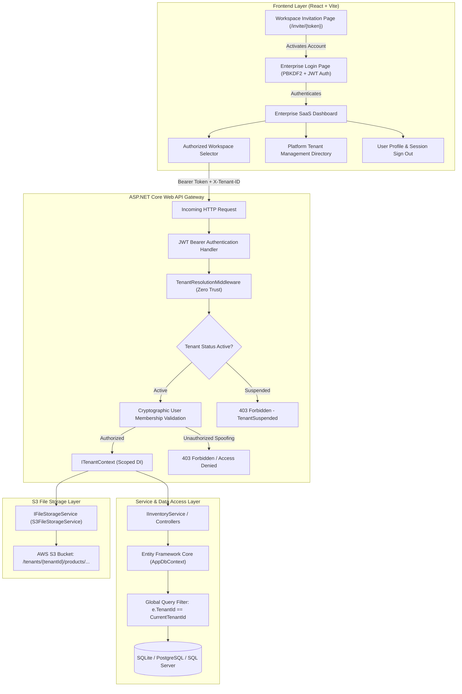

# INVENTRA MULTI-TENANT INVENTORY PLATFORM

[](https://dotnet.microsoft.com/)
[](https://jwt.io/)
[](https://learn.microsoft.com/en-us/ef/core/)
[](https://react.dev/)
[](https://aws.amazon.com/s3/)
[](#security-guarantees)

---

## 📌 Executive Summary

**Inventra Multi-Tenant Inventory Platform** is a production-grade enterprise SaaS architecture designed to host multiple independent organizations (*Acme Retail*, *Nova Electronics*, *Zenith Supplies*, and dynamically provisioned tenants) on a shared infrastructure while enforcing **hardware-grade mathematical isolation** of data and file storage across all application layers.

### Core Tenet
> **"Never trust client claims alone."**  
> Authentication is strictly enforced via **cryptographic JWT Bearer tokens** with PBKDF2 password hashing. A request header such as `X-Tenant-ID` only states *requested workspace context*. Multi-tenant authorization is validated server-side by checking the authenticated user's `TenantMemberships` against the database before initializing scoped dependency injection (`ITenantContext`) and **EF Core Global Query Filters** that automatically inject tenant boundary predicates into every database query.

---

## 🏢 Platform Administrator & Atomic Tenant Onboarding

Inventra features a complete, enterprise-grade **Tenant Onboarding & Provisioning Workflow** that allows Platform Administrators to create, configure, and manage isolated tenant workspaces on the fly without manual database intervention.

```mermaid
sequenceDiagram
    autonumber
    actor Admin as Platform Admin (admin@platform.io)
    participant UI as Inventra Web App (/platform/tenants)
    participant API as PlatformTenantsController
    participant Service as TenantProvisioningService
    participant DB as AppDbContext (Transaction)
    actor NewAdmin as Initial Tenant Admin (e.g. Rahul Sharma)

    Admin->>UI: Fills "Provision New Tenant" Form
    UI->>API: POST /api/platform/tenants (Bearer JWT + Tenant Details)
    
    rect rgb(30, 41, 59)
        note over API, DB: Atomic Database Transaction
        API->>Service: ProvisionTenantAsync(request)
        Service->>DB: BeginTransactionAsync()
        Service->>DB: 1. Create Tenant (ID, Name, Code, Industry, Status=ACTIVE)
        Service->>DB: 2. Create Initial User (usr_{slug}_admin, Role=MANAGER)
        Service->>DB: 3. Create TenantMembership (TenantId, UserId, Role=OWNER)
        Service->>DB: 4. Create TenantInvitation (SHA-256 TokenHash, 72h Expiry)
        Service->>DB: 5. Write AuditLog (Action=TENANT_PROVISIONED)
        Service->>DB: CommitTransactionAsync()
    end

    API-->>UI: 201 Created (Tenant ID + Raw Invitation Token Link)
    UI-->>Admin: Displays Provisioning Success & One-Click Invitation Link (/invite/{token})
    Admin->>NewAdmin: Sends One-Time Activation Link
    
    NewAdmin->>UI: Opens /invite/{token}
    UI->>API: GET /api/invitations/{token} (Inspect details)
    API-->>UI: 200 OK (Workspace info, Invited Name, Email)
    NewAdmin->>UI: Sets & Confirms Master Password
    UI->>API: POST /api/invitations/{token}/accept
    API->>Service: AcceptInvitationAsync(token, password)
    Service->>DB: Updates User PasswordHash & Status=ACCEPTED
    API-->>UI: 200 OK (Account Activated)
    NewAdmin->>UI: Signs In to new isolated workspace
```



### Key Provisioning Guarantees
1. **Atomic Provisioning:** Tenant, initial user, tenant membership, invitation token, and initial audit logs are created inside an ACID database transaction. If any step fails, the entire transaction rolls back cleanly.
2. **Cryptographic Token Hashing:** Invitation tokens are generated using a cryptographically secure 256-bit random generator. The raw token is returned once to the caller; only the SHA-256 hash is persisted in the database.
3. **Role Segregation (Platform Admin vs Tenant Admin):** Only platform administrators (`Role == "ADMIN"`) can provision tenants, suspend/activate workspaces, or list global tenants. Tenant administrators and standard users receive `403 Forbidden` if attempting platform operations.
4. **Tenant Status Lifecycle (`ACTIVE` vs `SUSPENDED`):** Platform administrators can immediately toggle tenant status. When a tenant is `SUSPENDED`, the `TenantResolutionMiddleware` rejects all incoming API requests targeting that tenant with `403 Forbidden (TenantSuspended)`.
5. **Zero-Trust Initial Workspace Access:** The newly provisioned Tenant Admin has access strictly scoped to their newly created workspace, with no visibility or access into Acme Retail, Nova Electronics, or Zenith Supplies.

---

## 🏗 Multi-Tenant Architecture & Defense-in-Depth



---

## 🛡 Demonstrable Isolation Across 6 Layers

| Layer | Implementation Mechanism | Security Guarantee |
| :--- | :--- | :--- |
| **1. Authentication Layer** | JWT Bearer Tokens + PBKDF2-SHA256 Password Hashing | Authenticated user identity derived exclusively from signed cryptographic JWT tokens. |
| **2. Middleware Layer** | `TenantResolutionMiddleware` | Intercepts `X-Tenant-ID` and cross-validates against database `TenantMemberships`. Rejects unauthorized spoofing with `403 Forbidden` and suspended tenants with `403 TenantSuspended`. |
| **3. Scoped Context** | `ITenantContext` / `TenantContext` | Thread-safe per-request DI container lifetime holding verified `CurrentTenantId` and `CurrentUserId`. |
| **4. EF Core Data Access** | `.HasQueryFilter(e => e.TenantId == _tenantContext.CurrentTenantId)` | Automatically appends `WHERE TenantId = @currentTenant` to all `SELECT`, `UPDATE`, `DELETE` queries. |
| **5. Database Storage** | `ITenantEntity` & Composite Unique Indexes `(TenantId, SKU)` | Hard multitenant relational schemas preventing cross-tenant collisions. |
| **6. File Storage (AWS S3)** | `IFileStorageService` + `tenants/{tenantId}/products/{fileName}` | S3 key paths derived strictly from server tenant context. No client-supplied path traversal possible. Cascade cleanup on product delete. |

---

## 👥 Demo Accounts & Workspaces

The platform seeds 3 distinct organizations and 4 enterprise accounts (Default demo password for all seeded accounts: `Inventra@2026!`):

| Account Name | Work Email | Platform Role | Authorized Workspaces | Description |
| :--- | :--- | :--- | :--- | :--- |
| **Admin User** | `admin@platform.io` | `ADMIN` (Platform Admin) | Acme Retail, Nova Electronics | Multi-Tenant Platform Owner with full tenant provisioning and management capabilities. |
| **Nova Electronics Manager** | `manager@nova-electronics.io` | `MANAGER` | Nova Electronics | Operations Lead with single-workspace scope. |
| **Zenith Supplies Specialist** | `specialist@zenith-supplies.io` | `MANAGER` | Zenith Supplies | Inventory Specialist with single-workspace scope. |
| **Acme Compliance Auditor** | `auditor@acme-retail.com` | `VIEWER` | Acme Retail | Read-only compliance auditor for Acme Retail. |

---

## 🚀 Quick Start Guide

### Prerequisites
- [.NET 8.0 SDK](https://dotnet.microsoft.com/)
- [Node.js v18+ & npm](https://nodejs.org/)

### 1. Run the Backend API
```powershell
cd backend/MultiTenantInventory.Api
dotnet run
```
* API Server will start at: `http://localhost:5000`
* Interactive Swagger API Docs with Bearer JWT Support: `http://localhost:5000/swagger`

### 2. Run the Frontend Dashboard
```powershell
cd frontend
npm install
npm run dev
```
* Open in browser: `http://localhost:5173`

---

## 🧪 Running Automated Security Verification Tests

Execute the comprehensive xUnit test suite (25 automated integration tests covering authentication, tenant onboarding, tenant isolation, S3 key isolation, and cascade cleanup):

```powershell
dotnet test backend/MultiTenantInventory.Tests/MultiTenantInventory.Tests.csproj
```

---

## 🎯 Step-by-Step Demonstration Flow

1. **Step 1 - Enterprise Sign In:** On `http://localhost:5173`, select the **Admin User** persona (`admin@platform.io` / `Inventra@2026!`) and click **Sign In**.
2. **Step 2 - Provision New Tenant Workspace:** In the left sidebar, click **Tenant Directory** under *Platform Admin*, then click **[ + Provision New Tenant ]**.
3. **Step 3 - Atomic Provisioning:** Fill out organization details (e.g. *Orbit Healthcare Logistics*, slug: `orbit-healthcare`, admin: *Rahul Sharma*, email: `rahul@orbithealthcare.com`) and click **Atomically Provision Tenant**.
4. **Step 4 - Invitation & Account Setup:** Copy the generated invitation link (`/invite/{token}`) and open it. Observe real-time password criteria validation, set master password `OrbitAdmin@2026!`, and activate the account.
5. **Step 5 - Isolated Tenant Session:** Sign in as `rahul@orbithealthcare.com`. Observe that Rahul has access strictly isolated to Orbit Healthcare, with an empty catalog and zero access to Acme or Nova data.
6. **Step 6 - Live Security Attack Bench:** Navigate to **"Isolation Bench"** in the sidebar and click **"Run All 5 Test Scenarios"** to verify 100% defense against IDOR, header spoofing, cross-tenant mutation, deletion, and S3 path traversal.
